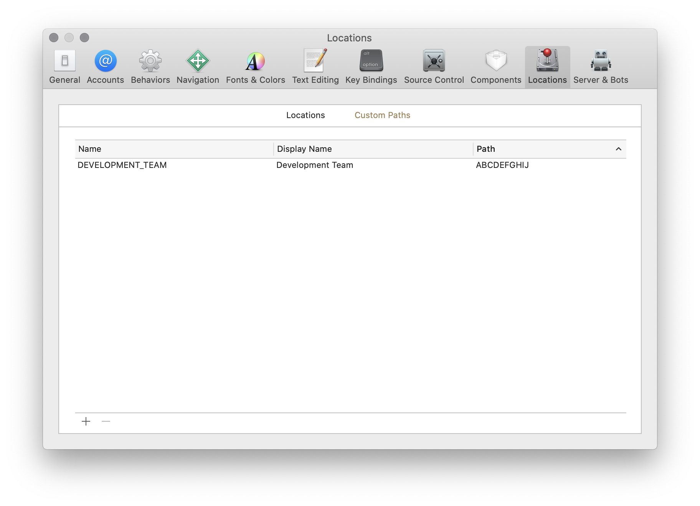

# RSParser

This framework was developed for [NetNewsWire](https://github.com/brentsimmons/NetNewsWire) and is made available here for developers who just need the parsing code. It has no depencies that aren’t provided by the system.

_Update 6 Feb. 2018_: RSParser is now a CocoaPod, with the much-appreciated help of [Silver Fox](https://github.com/dcilia). (We _think_ it worked, anyway. Looked like it did.)

## What’s inside

This framework includes parsers for:

* [RSS](http://cyber.harvard.edu/rss/rss.html), [Atom](https://tools.ietf.org/html/rfc4287), [JSON Feed](https://jsonfeed.org/), and [RSS-in-JSON](https://github.com/scripting/Scripting-News/blob/master/rss-in-json/README.md)
* [OPML](http://dev.opml.org/)
* Internet dates
* HTML metadata and links
* HTML entities

It also includes Objective-C wrappers for libXML2’s XML SAX and HTML SAX parsers. You can write your own parsers on top of these.

This framework builds for macOS. It *could* be made to build for iOS also, but I haven’t gotten around to it yet.

## How to compile

Go to Xcode menu → Preferences… → Locations → Custom Paths and enter [your development team identifier](https://stackoverflow.com/questions/18727894/how-can-i-find-my-apple-developer-team-id-and-team-agent-apple-id/47732584#47732584) as shown in this screenshot:

Name: `DEVELOPMENT_TEAM`

Display Name: `Development Team`

Path: *Your 10 characters development team identifier*

See [How to prevent Xcode 8 from saving “development team” in .pbxproj?](https://stackoverflow.com/questions/39669661/how-to-prevent-xcode-8-from-saving-development-team-in-pbxproj/40424891#40424891) on Stack Overflow for more information.

## How to parse feeds

To get the type of a feed, even with partial data, call `FeedParser.feedType(parserData)`, which will return a `FeedType`.

To parse a feed, call `FeedParser.parse(parserData)`, which will return a [ParsedFeed](Feeds/ParsedFeed.swift). Also see related structs: `ParsedAuthor`, `ParsedItem`, `ParsedAttachment`, and `ParsedHub`.

You do *not* need to know the type of feed when calling `FeedParser.parse` — it will figure it out and use the correct concrete parser.

However, if you do want to use a concrete parser directly, see [RSSInJSONParser](Feeds/JSON/RSSInJSONParser.swift), [JSONFeedParser](Feeds/JSON/JSONFeedParser.swift), [RSSParser](Feeds/XML/RSSParser.swift), and [AtomParser](Feeds/XML/AtomParser.swift).

(Note: if you want to write a feed reader app, please do! You have my blessing and encouragement. Let me know when it’s shipping so I can check it out.)

## How to parse OPML

Call `+[RSOPMLParser parseOPMLWithParserData:error:]`, which returns an `RSOPMLDocument`. See related objects: `RSOPMLItem`, `RSOPMLAttributes`, `RSOPMLFeedSpecifier`, and `RSOPMLError`.

## How to parse dates

Call `RSDateWithString` or `RSDateWithBytes` (see `RSDateParser`). These handle the common internet date formats. You don’t need to know which format.

## How to parse HTML

To get an array of `<a href=…` links from from an HTML document, call `+[RSHTMLLinkParser htmlLinksWithParserData:]`. It returns an array of `RSHTMLLink`.

To parse the metadata in an HTML document, call `+[RSHTMLMetadataParser HTMLMetadataWithParserData:]`. It returns an `RSHTMLMetadata` object.

To write your own HTML parser, see `RSSAXHTMLParser`. The two parsers above can serve as examples.

## How to parse HTML entities

When you have a string with things like `&#8212;` and `&euml;` and you want to turn those into the correct characters, call `-[NSString rsparser_stringByDecodingHTMLEntities]`. (See `NSString+RSParser.h`.)

## How to parse XML

If you need to parse some XML that isn’t RSS, Atom, or OPML, you can use `RSSAXParser`. Don’t subclass it — instead, create an `RSSAXParserDelegate`. See `RSRSSParser`, `RSAtomParser`, and `RSOPMLParser` as examples.

### Why use libXML2’s SAX API?

SAX is kind of a pain because of all the state you have to manage.

An alternative is to use `NSXMLParser`, which is event-driven like SAX. However, `RSSAXParser` was written to avoid allocating Objective-C objects except when absolutely needed. You’ll note use of things like `memcp` and `strncmp`.

Normally I avoid this kind of thing *strenuously*. I prefer to work at the highest level possible.

But my more-than-a-decade of experience parsing XML has led me to this solution, which — last time I checked, which was, admittedly, a few years ago — was not only fastest but also uses the least memory. (The two things are related, of course: creating objects is bad for performance, so this code attempts to do the minimum possible.)

All that low-level stuff is encapsulated, however. If you just want to parse one of the popular feed formats, see `FeedParser`, which makes it easy and Swift-y.

## Thread safety

Everything here is thread-safe.

Everything’s pretty fast, too, so you probably could just use the main thread/queue. But it’s totally a-okay to use a non-serial background queue.

